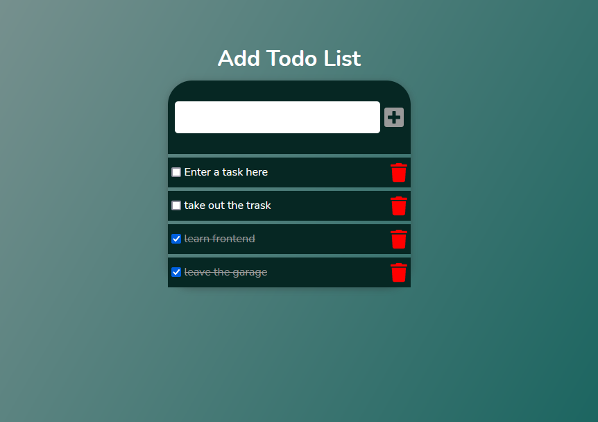

## todolist-vuejs-laravel
 A todolist app with vue.js frontend and laravel backend
 

## Installation
Run composer install from your terminal (make sure composer is install on your local machine)  
Run npm install from your terminal
Import attached .SQL File directly - Find it in this directory database/Todolist.sql  

## Deployment
Clone the repo or download as a zip  
Extract it into xampp/htdocs/ or opt/lampp/htdocs/ or var/www/html/ 
Create a database named Todolist  

Access it directly on web browser by typing http://Your Server Name Or IP Address/TodolistApp/  
You can also start the application by running `php artisan serve` copy the URL (http://127.0.0.1:8000) paste it on your browser
